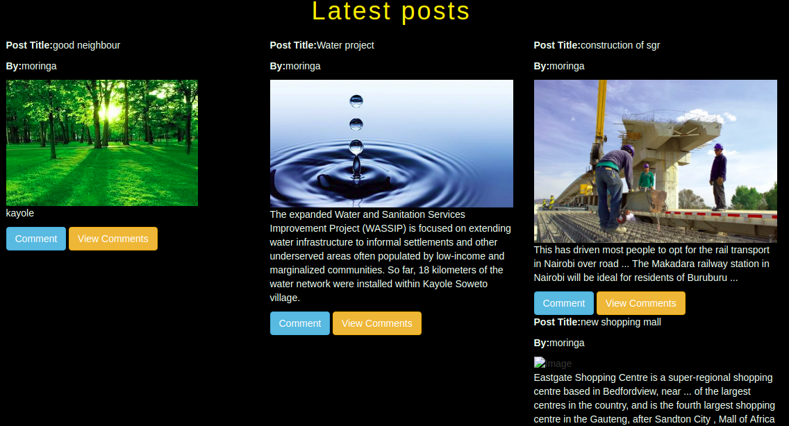

# HOOD WATCH
#### CHIEF ARCHITECT **[DENNIS KAROBIA](https://github.com/karobia001)**

## Description
This is a  neighbourhood watch application





## BDD

| Behavior            | Input                         | Output                        |
| ------------------- | ----------------------------- | ----------------------------- |
| enter our page | login with your ushttps://hodeno.herokuapp.com/ername | you are taken to our homepage |
| add business | Click on the the business  | you are taken to the file where you can add your business and email infomation |
| Search | Search business | Redirects you to the searched business and its information |
| edit profile | you are taken to where you can upload your profile | you profile appears |


## Live link

https://hodeno.herokuapp.com/
### Prerequsites
    - Python 3.6
    - Ubuntu software
    - Django

### Clone the Repo
Run the following command on the terminal:

`git clone https://github.com/karobia001/Hood`

Install  [Postgres](https://www.postgresql.org/download/)
 
### Create a Virtual Environment
Run the following commands in the same terminal:
`pip install virtualenv`
`python3.6 -m venv virtual`
`source virtual/bin/activate`

### Install dependencies
Install dependencies that will create an environment for the app to run
`pip3 install -r requirements`

### Create a database

```
psql

CREATE DATABASE <database_name>;


## Run initial Migration
```
python3.6 manage.py makemigrations instagram
python3.6 manage.py migrate

```


### Running the app in development
In the same terminal type:
`python3 manage.py runserver`

Open the browser on `http://localhost:8000/`

## Known bugs

Follow functionality issues. Fix coming soon.


## Technologies used
    - Python 3.6
    - HTML
    - Bootstrap 4
    - Django2
    - Postgresql

## Support and contact details
Contact me on karobiamaina81@gmail.com  for any comments, reviews or collaboration.

### License
MIT - Licence